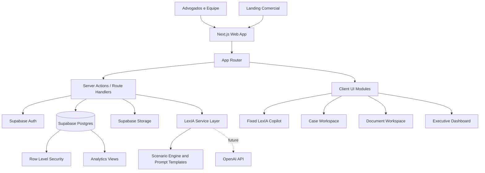
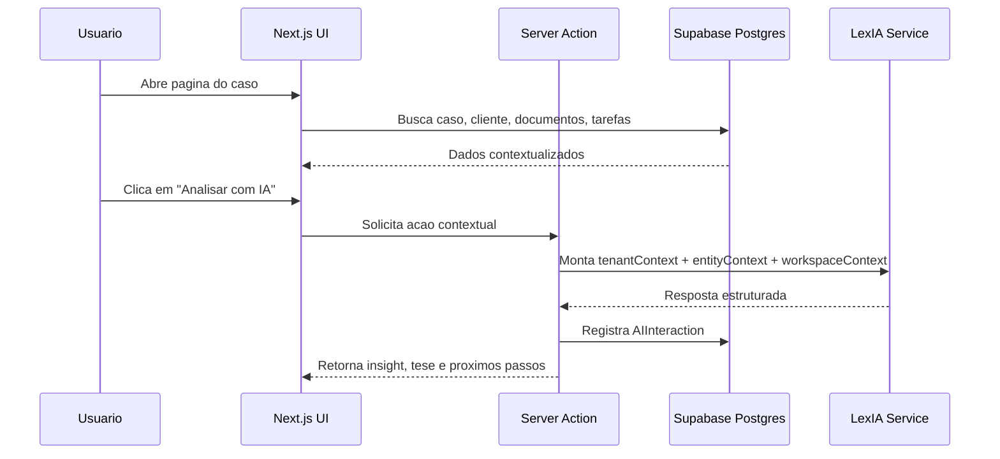
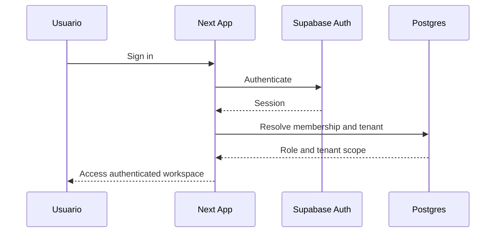

# LexIA Bancaria Fullstack Architecture

**Version:** 1.0.0
**Last Updated:** 2026-04-08
**Status:** Draft
**Author:** Aria

---

## Introduction

Este documento define a arquitetura full-stack do MVP premium da LexIA Bancaria. O objetivo e transformar a visao de produto em uma base tecnica pragmatica, escalavel e coerente com um SaaS juridico verticalizado em Direito Bancario.

O projeto e greenfield. Nao ha codigo de aplicacao iniciado, entao a arquitetura pode ser desenhada para reduzir retrabalho e criar uma base clara para implementacao por stories. O foco do MVP e demonstracao comercial forte, operacao central funcional e IA contextual convincente, sem depender de integracoes juridicas reais logo no primeiro ciclo.

### Starter Template or Existing Project

N/A - Greenfield project.

### Change Log

| Date | Version | Description | Author |
| --- | --- | --- | --- |
| 2026-04-08 | 1.0.0 | First architecture draft for LexIA Bancaria MVP | Aria |

---

## High Level Architecture

### Technical Summary

LexIA Bancaria sera implementada como um full-stack app em Next.js com App Router, usando uma arquitetura modular de monolito bem organizado, hospedado na Vercel e apoiado por Supabase para autenticacao, banco Postgres e armazenamento de arquivos. O frontend e o backend compartilharao o mesmo workspace TypeScript, com componentes de UI, tipos de dominio, mocks e servicos organizados por contexto funcional. O acesso aos dados do tenant sera protegido por RLS no Supabase e reforcado na camada de aplicacao por guards de sessao e resolucao de escopo. A IA do MVP sera implementada como uma service layer contextual preparada para futura integracao com OpenAI, mas inicialmente alimentada por cenarios, templates e respostas estruturadas por tipo de entidade. Essa arquitetura atende o objetivo do produto porque prioriza velocidade de entrega, UX premium, isolamento multi-tenant e evolucao segura para capacidades mais profundas de IA e automacao.

### Platform and Infrastructure Choice

#### Option 1: Vercel + Supabase

Pros:

1. Melhor encaixe para Next.js App Router
2. Time-to-market curto para SaaS MVP
3. Auth, Postgres e Storage ja integrados
4. Boa ergonomia para deploy, previews e edge delivery

Cons:

1. Dependencia mais forte de um stack opinionated
2. Menor flexibilidade de infraestrutura no inicio

#### Option 2: AWS Full Stack

Pros:

1. Escalabilidade enterprise e controle fino
2. Maior flexibilidade para separar servicos cedo

Cons:

1. Complexidade operacional desnecessaria para o MVP
2. Setup mais lento e mais caro em energia de projeto

#### Option 3: Railway + Supabase

Pros:

1. Simples para backend customizado
2. Boa experiencia para projetos enxutos

Cons:

1. Menor encaixe natural que Vercel para App Router full-stack
2. Menor ganho operacional se o app principal ficar em Next.js

**Recommendation**

**Platform:** Vercel + Supabase
**Key Services:** Vercel Hosting, Vercel Preview Deployments, Supabase Auth, Supabase Postgres, Supabase Storage
**Deployment Host and Regions:** Vercel with primary region close to target audience in South America when available; Supabase project in region with lowest latency to Brazil

### Repository Structure

**Structure:** Monorepo application-first
**Monorepo Tool:** npm workspaces
**Package Organization:** Single deployable app in `apps/web` plus shared packages in `packages/` for UI, domain types, mocks and config

Rationale:

1. O projeto ainda e um unico produto, nao uma familia de apps
2. O monorepo simples preserva compartilhamento sem impor Turborepo cedo demais
3. O crescimento para mais apps ou workers continua viavel no futuro

### High Level Architecture Diagram



### Architectural Patterns

- **Modular Monolith:** uma aplicacao full-stack unica com limites claros por contexto de dominio - _Rationale:_ reduz complexidade inicial sem sacrificar organizacao.
- **App Router with Server-First Rendering:** paginas e layouts orientados a server components, com client components apenas onde a interacao exigir - _Rationale:_ melhor performance, seguranca e simplicidade de dados.
- **Backend-for-Frontend Natural:** Route Handlers e Server Actions atuando como camada de orquestracao da UI - _Rationale:_ encaixe natural com Next.js e menor friccao de integracao.
- **Service Layer for AI and Domain Use Cases:** regras de negocio e orquestracao fora dos componentes - _Rationale:_ evita acoplamento da UI com logica contextual.
- **RLS-Centered Multi-Tenancy:** isolamento primario no banco e reforco na app layer - _Rationale:_ defesa em profundidade para SaaS multi-tenant.
- **Shared Domain Contracts:** tipos, enums e mocks compartilhados em packages - _Rationale:_ consistencia entre frontend, backend e fixtures.

---

## Tech Stack

| Category | Technology | Version | Purpose | Rationale |
| --- | --- | --- | --- | --- |
| Frontend Language | TypeScript | 5.x | Tipagem end-to-end | Seguranca de dominio e DX |
| Frontend Framework | Next.js | 14+ | Web app SaaS e landing page | App Router, SSR, server actions |
| UI Component Library | shadcn/ui | latest | Base de componentes premium | Flexibilidade visual sem lock-in |
| State Management | Zustand | 4.x | Estado global leve de UI | Bom encaixe com preset ativo e baixa complexidade |
| Backend Language | TypeScript | 5.x | Mesmo idioma em toda stack | Shared contracts e produtividade |
| Backend Framework | Next.js Route Handlers + Server Actions | 14+ | BFF e mutations | Mantem stack coesa no MVP |
| API Style | Internal BFF + typed services | N/A | Orquestracao app-first | Evita API publica inflada cedo |
| Database | Supabase Postgres | 15+ | Persistencia principal | Multi-tenant e relacional forte |
| Cache | Next.js cache + in-memory selective | N/A | Performance de leitura | Suficiente para MVP |
| File Storage | Supabase Storage | latest | Documentos juridicos | Integrado ao tenancy |
| Authentication | Supabase Auth | latest | Login e sessao | Menor friccao para MVP |
| Frontend Testing | Vitest + Testing Library | latest | Componentes e hooks | Rapido e moderno |
| Backend Testing | Vitest | latest | Servicos e handlers | Coesao com TS stack |
| E2E Testing | Playwright | latest | Fluxos criticos | Essencial para demo confiavel |
| Build Tool | Next.js build | 14+ | Build da app | Nativo da stack |
| Bundler | Turbopack / Next bundler | 14+ | Bundling | Default da plataforma |
| IaC Tool | Vercel and Supabase managed config | N/A | Infra do MVP | Pragmatismo para fase inicial |
| CI/CD | GitHub Actions + Vercel | latest | Checks e deploy | Fluxo padrao e simples |
| Monitoring | Vercel Analytics + Sentry | latest | Observabilidade | Cobertura pratica para MVP |
| Logging | Structured app logs + Supabase logs | N/A | Diagnostico | Simples e suficiente |
| CSS Framework | Tailwind CSS | 3.x/4.x compatible | Estilizacao | Rapidez com acabamento premium |

---

## Data Models

### Tenant

**Purpose:** representa o escritorio e delimita isolamento logico e de dados.

**Key Attributes:**

- `id`: string - identificador unico
- `name`: string - nome comercial do escritorio
- `slug`: string - identificador amigavel
- `plan`: `'trial' | 'starter' | 'pro'` - plano contratado
- `branding`: object - configuracoes visuais futuras

```typescript
export interface Tenant {
  id: string;
  name: string;
  slug: string;
  plan: "trial" | "starter" | "pro";
  createdAt: string;
  updatedAt: string;
}
```

**Relationships:**

- possui muitos `User`
- possui muitos `Client`
- possui muitos `BankingCase`

### User

**Purpose:** representa um membro da equipe com papel e escopo operacional.

**Key Attributes:**

- `id`: string - identificador do usuario
- `tenantId`: string - escritorio de origem
- `role`: `UserRole` - papel de acesso
- `fullName`: string - nome exibido
- `email`: string - login principal

```typescript
export type UserRole = "owner" | "admin" | "lawyer" | "assistant";

export interface User {
  id: string;
  tenantId: string;
  role: UserRole;
  fullName: string;
  email: string;
  isActive: boolean;
}
```

**Relationships:**

- pertence a `Tenant`
- pode ser responsavel por muitos `BankingCase`, `Task` e `Deadline`

### Client

**Purpose:** concentra dados cadastrais, comerciais e juridicos do atendido.

**Key Attributes:**

- `id`: string
- `tenantId`: string
- `fullName`: string
- `documentId`: string - CPF/CNPJ
- `leadSource`: string
- `serviceStatus`: string
- `legalViabilityScore`: number

```typescript
export interface Client {
  id: string;
  tenantId: string;
  fullName: string;
  documentId: string;
  email?: string;
  phone?: string;
  whatsapp?: string;
  leadSource?: string;
  bankName?: string;
  serviceStatus: "triage" | "active" | "waiting-docs" | "closed";
  legalViabilityScore?: number;
}
```

**Relationships:**

- pertence a `Tenant`
- possui muitos `BankingCase`
- possui muitos `Document`

### BankingCase

**Purpose:** entidade central do dominio juridico bancario.

**Key Attributes:**

- `id`: string
- `tenantId`: string
- `clientId`: string
- `title`: string
- `claimType`: `BankingClaimType`
- `stage`: string
- `status`: string
- `mainThesis`: string
- `legalRisk`: string

```typescript
export type BankingClaimType =
  | "acao_revisional"
  | "juros_abusivos"
  | "cartao_consignado"
  | "emprestimo_consignado"
  | "fraude_bancaria"
  | "golpe_pix"
  | "negativacao_indevida"
  | "busca_e_apreensao"
  | "embargos_execucao"
  | "execucao_bancaria"
  | "repeticao_indebito"
  | "danos_morais_bancarios"
  | "superendividamento"
  | "renegociacao_bancaria";

export interface BankingCase {
  id: string;
  tenantId: string;
  clientId: string;
  ownerUserId?: string;
  title: string;
  bankName: string;
  processNumber?: string;
  contractNumber?: string;
  claimType: BankingClaimType;
  stage: string;
  status: "draft" | "active" | "awaiting-action" | "closed";
  amountInDispute?: number;
  estimatedValue?: number;
  mainThesis?: string;
  legalRisk?: "low" | "medium" | "high";
  suggestedStrategy?: string;
}
```

**Relationships:**

- pertence a `Client`
- possui muitos `Document`
- possui muitos `Task`
- possui muitos `Deadline`
- possui muitas `AIInteraction`

### Document

**Purpose:** modela documentos com vinculo juridico e operacao de GED.

```typescript
export interface Document {
  id: string;
  tenantId: string;
  clientId?: string;
  bankingCaseId?: string;
  fileName: string;
  fileType: "pdf" | "doc" | "image" | "spreadsheet";
  category: string;
  tags: string[];
  storagePath: string;
  aiStatus: "not_analyzed" | "analyzed" | "needs_review";
}
```

**Relationships:**

- pode pertencer a `Client`
- pode pertencer a `BankingCase`
- pode originar `ContractAnalysis`

### Task

**Purpose:** representa trabalho operacional estruturado.

```typescript
export interface Task {
  id: string;
  tenantId: string;
  clientId?: string;
  bankingCaseId?: string;
  assigneeUserId?: string;
  title: string;
  description?: string;
  priority: "low" | "medium" | "high" | "urgent";
  status: "todo" | "in_progress" | "done";
  dueAt?: string;
  checklist: Array<{ id: string; label: string; done: boolean }>;
}
```

**Relationships:**

- pode estar vinculada a `Client`
- pode estar vinculada a `BankingCase`
- pode ser originada por `AIInteraction`

### Deadline

**Purpose:** controla prazos juridicos e internos.

```typescript
export interface Deadline {
  id: string;
  tenantId: string;
  bankingCaseId?: string;
  assigneeUserId?: string;
  publicationDate?: string;
  awarenessDate?: string;
  suggestedDeadlineDays?: number;
  dueDate: string;
  status: "open" | "completed" | "expired";
  recommendedAction?: string;
}
```

### AIInteraction

**Purpose:** rastreia respostas e acoes sugeridas pela LexIA.

```typescript
export interface AIInteraction {
  id: string;
  tenantId: string;
  entityType: "client" | "case" | "document" | "deadline" | "draft" | "global";
  entityId?: string;
  mode: "atendimento" | "analise" | "producao" | "operacional";
  promptLabel: string;
  summary: string;
  outputs: Record<string, unknown>;
  createdByUserId: string;
  createdAt: string;
}
```

---

## API and Application Boundary

No MVP, LexIA Bancaria nao precisa expor uma API publica ampla. O desenho recomendado e:

1. `Server Components` para leitura e composicao de telas
2. `Server Actions` para mutations simples e formularios
3. `Route Handlers` para endpoints internos mais complexos como upload, mocks de IA e feeds assinc
4. `Service Layer` em `src/server/services` para concentrar regras e nao espalhar acesso ao banco

Esse desenho reduz complexidade de contrato externo e acelera entrega. Se o produto evoluir para API publica, a service layer ja servira como base de extracao.

### Route Families

- `/app/(marketing)` - landing e paginas comerciais
- `/app/(auth)` - login e onboarding
- `/app/(workspace)` - area autenticada do produto
- `/app/api/ai/*` - endpoints internos da LexIA
- `/app/api/documents/*` - upload, metadata e actions
- `/app/api/search/*` - busca global futura

---

## Components

### App Shell

**Responsibility:** layout autenticado, sidebar, header, busca global e persistencia visual da LexIA.

**Key Interfaces:**

- authenticated workspace layout
- global navigation and command actions

**Dependencies:** auth, navigation config, theme, LexIA copilot container

**Technology Stack:** Next.js layouts, shadcn/ui, Tailwind

### Domain Modules

**Responsibility:** implementar UI, queries e actions por contexto de negocio.

**Key Interfaces:**

- clients module
- banking cases module
- documents module
- tasks module
- dashboard module

**Dependencies:** shared types, service layer, table components, forms

**Technology Stack:** React, TanStack Table, RHF, Zod

### LexIA Service Layer

**Responsibility:** montar contexto, resolver cenarios, produzir respostas estruturadas e registrar interacoes.

**Key Interfaces:**

- `getContextualAssistantResponse`
- `analyzeContractMock`
- `generateCaseInsights`

**Dependencies:** domain repositories, prompt templates, mock scenario engine

**Technology Stack:** TypeScript server modules

### Data Access Layer

**Responsibility:** encapsular queries ao Supabase e regras comuns de escopo.

**Key Interfaces:**

- tenant-scoped repositories
- dashboard aggregations
- document metadata access

**Dependencies:** Supabase server client

**Technology Stack:** Supabase JS SDK

### Analytics Read Models

**Responsibility:** consolidar metricas e paineis do dashboard e carteira.

**Key Interfaces:**

- summary cards
- chart datasets
- alerts and aging lists

**Dependencies:** Postgres views or composable queries

**Technology Stack:** SQL views + server fetch

---

## Core Workflows



---

## Database Architecture

### Multi-Tenancy Strategy

Modelo recomendado: **single database, shared schema, tenant-scoped rows com RLS**.

Rationale:

1. menor custo e menor friccao no MVP
2. isolamento suficiente para SaaS inicial
3. flexibilidade para crescer sem gerenciar muitos bancos

### Core Rules

1. toda tabela de dominio deve ter `tenant_id`
2. todo acesso autenticado deve resolver tenant ativo
3. RLS deve negar acesso cross-tenant por padrao
4. usuarios internos do produto so atuam via service role em operacoes administrativas controladas

### Suggested Core Tables

- `tenants`
- `profiles`
- `memberships`
- `clients`
- `banking_cases`
- `documents`
- `tasks`
- `deadlines`
- `legal_drafts`
- `contract_analyses`
- `ai_interactions`
- `activity_logs`

### Index Strategy For MVP

1. indexes por `tenant_id`
2. composites por `tenant_id + status`
3. composites por `tenant_id + banking_case_id`
4. search fields preparados para nome do cliente, numero do processo e numero do contrato

Nota: desenho detalhado de schema e indexes deve ser refinado com `@data-engineer`.

---

## Frontend Architecture

### Component Organization

```text
apps/web/src/
  app/
    (marketing)/
    (auth)/
    (workspace)/
  components/
    layout/
    charts/
    tables/
    shared/
    lexia/
  features/
    dashboard/
    clients/
    banking-cases/
    documents/
    tasks/
    lexia/
    settings/
    team/
  lib/
    auth/
    supabase/
    utils/
    validations/
  server/
    services/
    repositories/
    queries/
  styles/
```

### State Management Strategy

Usar Zustand apenas para estado global de UI e experiencia:

1. sidebar state
2. theme
3. LexIA panel state
4. search dialog state

Nao usar Zustand para duplicar state de dados do banco. Dados de tela devem vir preferencialmente de server components e invalidacao orientada por navigation refresh ou actions.

### Routing Architecture

```text
app/
  (marketing)/
    page.tsx
  (auth)/
    sign-in/page.tsx
  (workspace)/
    dashboard/page.tsx
    clientes/page.tsx
    clientes/[clientId]/page.tsx
    casos/page.tsx
    casos/[caseId]/page.tsx
    documentos/page.tsx
    tarefas/page.tsx
    lexia/page.tsx
    equipe/page.tsx
    configuracoes/page.tsx
```

### Protected Route Pattern

```typescript
export async function requireWorkspaceSession() {
  const session = await getServerSession();

  if (!session?.user) {
    redirect("/sign-in");
  }

  const membership = await getCurrentMembership(session.user.id);

  if (!membership) {
    redirect("/sign-in");
  }

  return { session, membership };
}
```

---

## Backend Architecture

### Service Organization

```text
src/server/
  services/
    auth/
    dashboard/
    clients/
    banking-cases/
    documents/
    tasks/
    lexia/
  repositories/
    tenants/
    users/
    clients/
    banking-cases/
    documents/
    tasks/
    deadlines/
    ai-interactions/
  queries/
    dashboard/
    search/
```

### Data Access Pattern

```typescript
export async function getCaseWorkspace(caseId: string, tenantId: string) {
  const supabase = await getServerSupabaseClient();

  const { data, error } = await supabase
    .from("banking_cases")
    .select(`
      *,
      client:clients(*),
      documents:documents(*),
      tasks:tasks(*),
      deadlines:deadlines(*)
    `)
    .eq("id", caseId)
    .eq("tenant_id", tenantId)
    .single();

  if (error) throw error;
  return data;
}
```

### Auth Flow



### Authorization Model

Perfis iniciais:

1. `owner`
2. `admin`
3. `lawyer`
4. `assistant`

Modelo:

1. autenticacao por identidade
2. autorizacao por membership tenant-aware
3. checks de papel na camada de aplicacao
4. RLS protegendo acesso de leitura e escrita no banco

---

## Unified Project Structure

```text
lexia-bancaria/
  .github/
    workflows/
  apps/
    web/
      src/
        app/
        components/
        features/
        lib/
        server/
        styles/
      public/
      tests/
  packages/
    ui/
    domain/
    mocks/
    config/
  supabase/
    migrations/
    seeds/
    policies/
  docs/
    product/
      lexia-bancaria/
  scripts/
  package.json
  tsconfig.base.json
  .env.example
```

---

## Development Workflow

### Local Development Setup

```bash
npm install
npm run dev
```

### Recommended Commands

```bash
# start app
npm run dev

# quality
npm run lint
npm run typecheck
npm test

# e2e
npm run test:e2e
```

### Required Environment Variables

```bash
NEXT_PUBLIC_SUPABASE_URL=
NEXT_PUBLIC_SUPABASE_ANON_KEY=
SUPABASE_SERVICE_ROLE_KEY=
NEXT_PUBLIC_APP_URL=
OPENAI_API_KEY=
SENTRY_DSN=
```

---

## Deployment Architecture

### Deployment Strategy

**Frontend Deployment:**

- **Platform:** Vercel
- **Build Command:** `npm run build`
- **Output Directory:** `.next`
- **CDN/Edge:** Vercel global edge delivery

**Backend Deployment:**

- **Platform:** same Next.js deployment
- **Build Command:** `npm run build`
- **Deployment Method:** integrated Route Handlers and Server Actions

### Environments

| Environment | Frontend URL | Backend URL | Purpose |
| --- | --- | --- | --- |
| Development | `http://localhost:3000` | `http://localhost:3000` | local dev |
| Staging | `staging domain` | `staging domain` | pre-prod validation |
| Production | `production domain` | `production domain` | live |

---

## Security and Performance

### Security Requirements

**Frontend Security:**

- CSP Headers: strict CSP baseline with allowed assets only
- XSS Prevention: React escaping + sanitized rich text boundaries
- Secure Storage: session managed by Supabase, no sensitive data in localStorage

**Backend Security:**

- Input Validation: Zod at boundaries
- Rate Limiting: lightweight rate limit on auth and AI actions
- CORS Policy: same-origin first

**Authentication Security:**

- Token Storage: secure httpOnly session handling where applicable
- Session Management: Supabase managed sessions
- Password Policy: delegated to Supabase defaults plus product guidance

### Performance Optimization

**Frontend Performance:**

- Bundle Size Target: lean initial shell, defer heavy charts and previews
- Loading Strategy: server rendering first, lazy-load charts/editor surfaces
- Caching Strategy: route-level caching for read-heavy screens where safe

**Backend Performance:**

- Response Time Target: under 300ms for common reads excluding file and AI flows
- Database Optimization: indexed tenant-scoped queries and pre-aggregated reads
- Caching Strategy: selective memoization for dashboard summary reads

---

## Testing Strategy

### Testing Pyramid

```text
          E2E Tests
         /        \
    Integration Tests
       /          \
Frontend Unit  Backend Unit
```

### Test Organization

```text
apps/web/tests/
  unit/
  integration/
  e2e/
```

### Critical MVP Coverage

1. auth and protected routes
2. tenant scoping in service layer
3. dashboard rendering
4. client and case detail flows
5. document action flows
6. LexIA contextual responses by entity

---

## Coding Standards

### Critical Fullstack Rules

- **Tenant Scope First:** toda query de dominio deve incluir escopo de tenant.
- **Server-First Data:** leitura principal via server components e service layer, nao via fetch ad hoc no client.
- **Shared Contracts:** enums e interfaces de dominio devem viver em package compartilhado.
- **No Direct Supabase in UI:** componentes de interface nao devem acessar Supabase diretamente.
- **AI Requires Context:** nenhuma acao da LexIA pode executar sem tenantContext e intentContext.
- **Validation at Boundary:** formularios e handlers sempre validados com Zod.

### Naming Conventions

| Element | Frontend | Backend | Example |
| --- | --- | --- | --- |
| Components | PascalCase | - | `CaseOverviewCard.tsx` |
| Hooks | camelCase with `use` | - | `useLexiaPanel.ts` |
| Route Segments | kebab-case or semantic path | - | `/casos/[caseId]` |
| Tables | - | snake_case | `banking_cases` |

---

## Error Handling Strategy

### Error Response Format

```typescript
interface AppErrorShape {
  code: string;
  message: string;
  details?: Record<string, unknown>;
  requestId?: string;
}
```

### Strategy

1. erros de validacao com mensagem clara para UI
2. erros de autorizacao sem vazar detalhes internos
3. erros de dominio logados com contexto
4. erros de IA retornando fallback util, nunca tela quebrada

---

## Monitoring and Observability

### Monitoring Stack

- **Frontend Monitoring:** Vercel Analytics
- **Backend Monitoring:** Vercel logs and Supabase logs
- **Error Tracking:** Sentry
- **Performance Monitoring:** Web Vitals + route timings

### Key Metrics

**Product and UX**

- tempo de carregamento do dashboard
- tempo para abrir pagina de caso
- taxa de erro em upload
- uso da LexIA por modulo

**Platform**

- error rate por route handler
- latency por servico
- falhas de auth
- falhas de queries tenant-scoped

---

## Recommended Next Technical Steps

1. `@data-engineer` para schema detalhado, RLS e seeds iniciais
2. `@po` ou `@sm` para quebrar esta arquitetura em stories do MVP
3. `@dev` para scaffold do projeto em Next.js seguindo esta estrutura

---

_Last Updated: 2026-04-08 | Aria_
